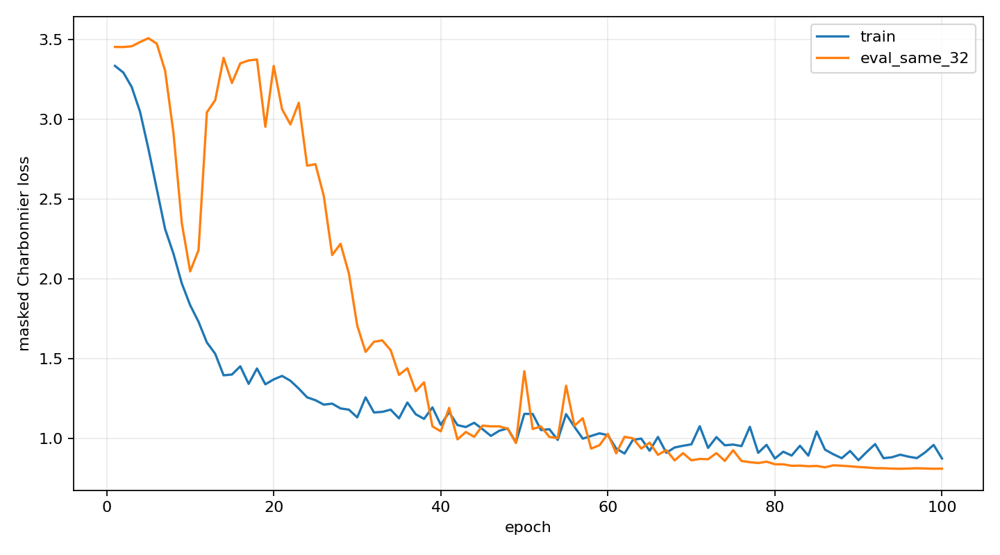
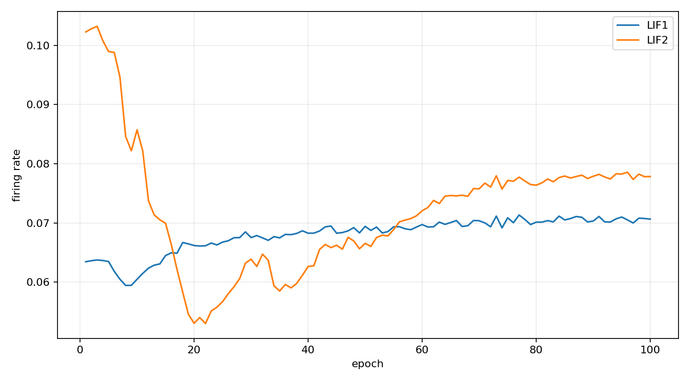
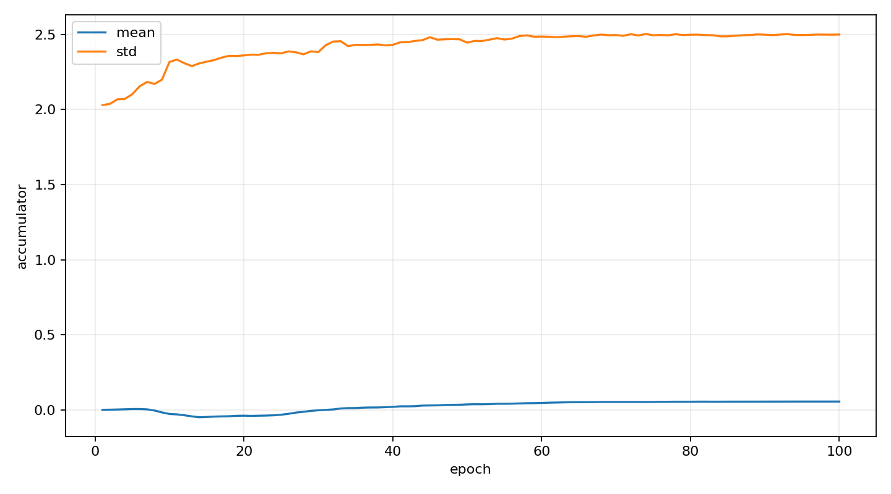
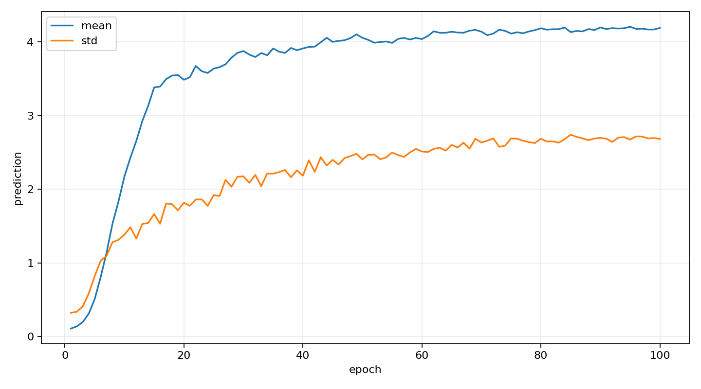
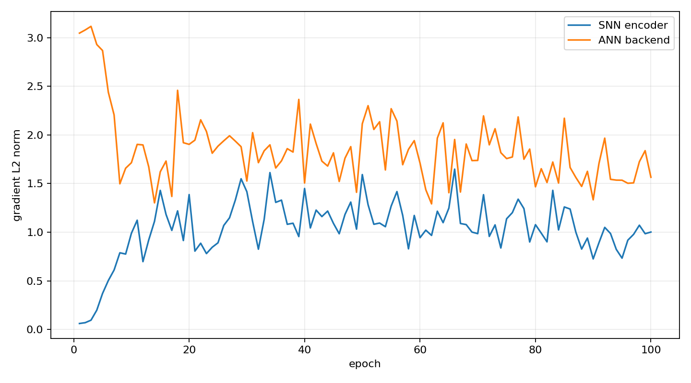

# Hybrid SNN-EV-Slim 32-Block 过拟合实验报告

- 总体结果：通过
- 数据：从真实 train H5 固定抽取 32 个合法 `T=3, stride=3` 连续窗口，关闭增强。
- 训练：100 epochs，batch=4，AMP FP16，AdamW + OneCycleLR。
- 执行命令：`EV-TTC-main/.venv/bin/python EV-TTC-SNN-main/snn_ttc/train_hybrid_snn_evslim_real.py --mode overfit32`
- 初始 eval loss：`3.453309`
- 最终 train/eval loss：`0.872391` / `0.808737`
- loss 相对下降：`76.58%`
- 初始/最终 masked MAE：`4.046160` / `0.860931`
- 初始/最终空间相关系数：`0.000000` / `0.800637`

## 最终内部统计

- LIF1/LIF2 发放率：`7.0629%` / `7.7832%`
- accumulator mean/std：`0.055397` / `2.499268`
- prediction mean/std：`4.188839` / `2.682504`
- SNN/ANN 梯度范数：`1.00151` / `1.56525`
- AMP scaler scale：`65536.0`

## 判定

- loss 至少下降 30%：通过
- 全程无 NaN/Inf：通过
- 发放率未坍缩或饱和：通过
- SNN/ANN 梯度持续有效：通过
- accumulator 稳定：通过
- 输出未坍缩为常数：通过
- 预测空间结构相关性改善：通过

## 输出

- 最佳 checkpoint：`/home/hello/research_project/event+SNN+TTC/EV-TTC-SNN-main/reports/06_真实数据端到端验证/checkpoints/best.pt`
- 最后 checkpoint：`/home/hello/research_project/event+SNN+TTC/EV-TTC-SNN-main/reports/06_真实数据端到端验证/checkpoints/last.pt`
- 可视化：`可视化结果/epoch_000,001,005,010,020,050,100/`
- 曲线：`可视化结果/曲线/`
- 是否适合进入 200-Block 速度标定：是

## 训练曲线

